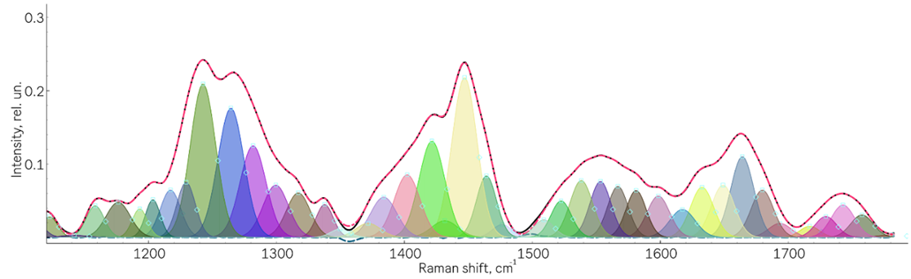

# Description
Key features of Raman spectrum decomposition method.
This repository presents a developed two-stage method for decomposing a spectral contour with a high degree of overlap of Raman scattering (RS) lines. The algorithm allows you to take into account the error in the position of the maxima of the Raman lines and other parameters, and work with asymmetric lines. By determining the final model based on multiple spectra, it allows the Raman lines to be correctly identified. A model experiment was carried out to reconstruct the composition and parameters of elementary lines based on synthetic spectra. The error in determining the line parameters was: MAPE (mean absolute percentage error) = 0.3% for amplitude, MAPE = 0.3% for half-width dx and MAE (mean absolute error) = 0.1 cm-1 for the position of line maxima x0. The algorithm was applied to the real problem of analyzing the spectra of demineralized dentin.

